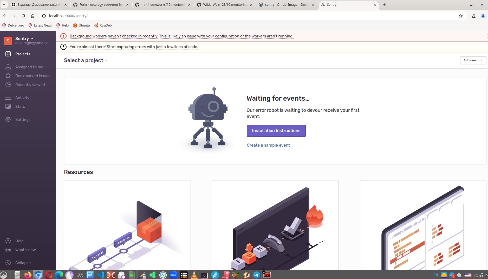
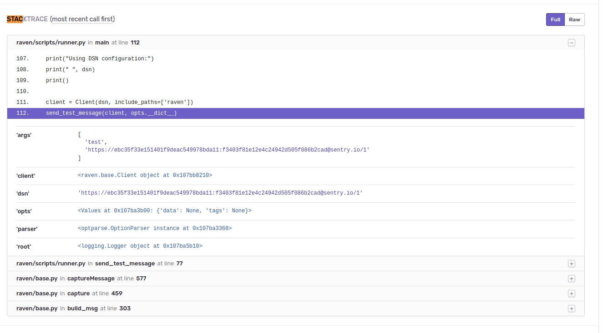
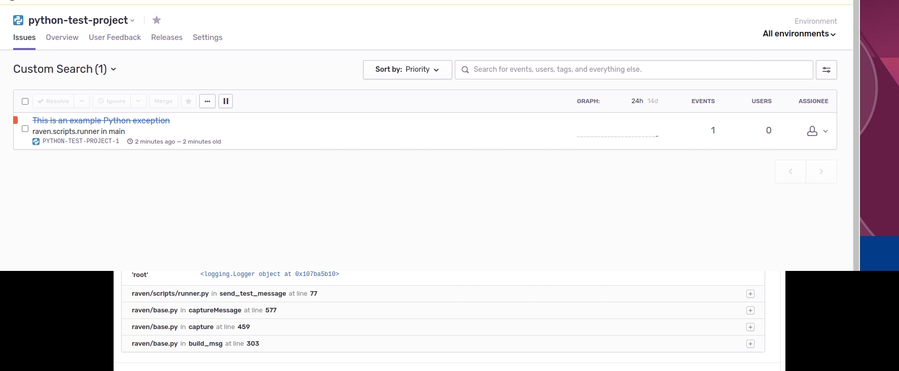

# Домашнее задание к занятию 16 «Платформа мониторинга Sentry»

## Задание 1

Так как Self-Hosted Sentry довольно требовательная к ресурсам система, мы будем использовать Free Сloud account.

Free Cloud account имеет ограничения:

- 5 000 errors;
- 10 000 transactions;
- 1 GB attachments.

Для подключения Free Cloud account:

> - зайдите на sentry.io;
> - нажмите «Try for free»;
> - используйте авторизацию через ваш GitHub-аккаунт;
> - далее следуйте инструкциям.

> В качестве решения задания пришлите скриншот меню Projects.

К сожалению, sentry.io выдает 403 при обращении. В связи с чем будем поднимать в докере:

```
docker run -d --name sentry-postgres -e POSTGRES_PASSWORD=secret -e POSTGRES_USER=sentry postgres
docker run -it --rm -e SENTRY_SECRET_KEY='y=#4s0iefhz#mx@1yvd=g5n*(#-r#%gt-_3prrzy%+%8b75f2a' --link sentry-postgres:postgres --link sentry-redis:redis sentry upgrade
docker run -d --name my-sentry -e SENTRY_SECRET_KEY='y=#4s0iefhz#mx@1yvd=g5n*(#-r#%gt-_3prrzy%+%8b75f2a' --link sentry-redis:redis --link sentry-postgres:postgres sentry
docker run -d -p9000:9000 --name my-sentry -e SENTRY_SECRET_KEY='y=#4s0iefhz#mx@1yvd=g5n*(#-r#%gt-_3prrzy%+%8b75f2a' --link sentry-redis:redis --link sentry-postgres:postgres sentry
```



## Задание 2

1. Создайте python-проект и нажмите `Generate sample event` для генерации тестового события.
1. Изучите информацию, представленную в событии.
1. Перейдите в список событий проекта, выберите созданное вами и нажмите `Resolved`.
> 1. В качестве решения задание предоставьте скриншот `Stack trace` из этого события 



> и список событий проекта после нажатия `Resolved`.

Список событий пуст



Убедимся что событие действительно было:


## Задание 3

1. Перейдите в создание правил алёртинга.
2. Выберите проект и создайте дефолтное правило алёртинга без настройки полей.
3. Снова сгенерируйте событие `Generate sample event`.
Если всё было выполнено правильно — через некоторое время вам на почту, привязанную к GitHub-аккаунту, придёт оповещение о произошедшем событии.
4. Если сообщение не пришло — проверьте настройки аккаунта Sentry (например, привязанную почту), что у вас не было 
`sample issue` до того, как вы его сгенерировали, и то, что правило алёртинга выставлено по дефолту (во всех полях all).
Также проверьте проект, в котором вы создаёте событие — возможно алёрт привязан к другому.
> 5. В качестве решения задания пришлите скриншот тела сообщения из оповещения на почте.
> 6. Дополнительно поэкспериментируйте с правилами алёртинга. Выбирайте разные условия отправки и создавайте sample events. 

К сожалению, из докера отправить сообщение не получилось. 
Отредактировал и залил конфиг в контейнер:

```
docker cp ff19faaa77a0:/etc/sentry/config.yml .
nano config.yml 
cp config.yml ff19faaa77a0:/etc/sentry/config.yml
```

Конфиг:

```
mail.backend: 'smtp'  # Use dummy if you want to disable email entirely
mail.host: 'smtp.yandex.com'
#localhost'
mail.port: 465
mail.username: 'auseregin@yandex.ru'
mail.password: 'asdasdasdasdsadasd'
mail.use-tls: true
#The email address to send on behalf of
mail.from: 'auseregin@yandex.ru'
```

Однако ни к чему это не привело - письма скапливаются в очередь:

```
20:06:16 [INFO] sentry.mail: mail.queued (message_to=(u'auseregin@yandex.ru',) user_id=1 message_type=u'user.confirm_email' message_id=u'<20250126200616.20.18759@yandex.ru>')
20:06:16 [INFO] sentry.accounts: user.email.start_confirm (user_id=1 email=<UserEmail at 0x7019b309cbd0: id=1L, user_id=1, email=u'auseregin@yandex.ru'> ip_address=u'172.17.0.1')
20:06:16 [INFO] sentry.superuser: superuser.request (user_id=1 url=u'http://localhost:9000/api/0/users/me/emails/' ip_address=u'172.17.0.1' method=u'GET')
```

но для отправки используется не заданный, а локальный сервер.
Отлаживать причину проблемы в принципе невозможно, учитывая что контейнер поднят с официального docker-образа на Debian Buster, и никакие репозитории уже не работают (возможно проблема также в устаревших сертификатах и цепочках, неподдерживаемых TLS и прочее).

## Задание повышенной сложности

1. Создайте проект на ЯП Python или GO (около 10–20 строк), подключите к нему sentry SDK и отправьте несколько тестовых событий.
2. Поэкспериментируйте с различными передаваемыми параметрами, но помните об ограничениях Free учётной записи Cloud Sentry.
3. В качестве решения задания пришлите скриншот меню issues вашего проекта и пример кода подключения sentry sdk/отсылки событий.

---

### Как оформить решение задания

Выполненное домашнее задание пришлите в виде ссылки на .md-файл в вашем репозитории.

---
